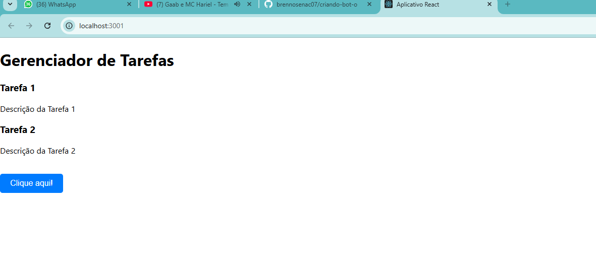

# Brenno Elimar 06/12/2024

## Funcionalidades

- **Botão Interativo**: Um botão que exibe um alerta e muda de texto ao ser clicado
- **Componentização**: Inclui os componentes *Header* e *TaskContainer* 

## Estrutura do Código

- **Estado**: Usa o hook *useState* para gerenciar o texto do botão
- **Evento**: A função *handleClick* manipula o clique do botão, exibindo um alerta e atualizando o estado
- **Estilização**: O botão é estilizado inline com propriedades como cor de fundo, bordas arredondadas e fonte personalizada

## Como Executar

1. Instale as dependências com:
   npm install

2. Inicie o servidor de desenvolvimento:
   npm start

## Próximos Passos

- Expandir os componentes *Header* e *TaskContainer*
- Melhorar a estilização movendo-a para arquivos CSS

