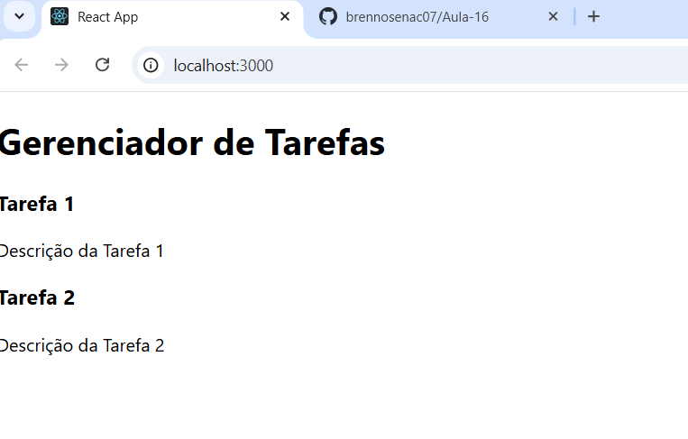

# Brenno Elimar - 04/12/2024

1. **Configuração do Projeto**: 
    Criação de um projeto React utilizando *create-react-app*
    Instalação de dependências adicionais como *prop-types*

2. **Estrutura do Projeto**:
    Criação de um layout com dois contêineres principais:
      Um cabeçalho para o título do projeto
      Uma área para exibição da lista de tarefas

3. **Componentização**:
    Criação de componentes independentes:
      **Header**: Responsável por exibir o título do projeto
      **TaskContainer**: Gerencia e exibe a lista de tarefas
      **Task**: Renderiza individualmente cada tarefa utilizando *props* para exibir título e descrição

4. **Uso de React.Fragment**:
    Implementado no componente *TaskContainer* para agrupar múltiplos elementos JSX sem adicionar nós extras no DOM.

5. **Listagem Dinâmica**:
    Exibição de uma lista de tarefas fictícias utilizando o método *map()* do JavaScript.

6. **Validação de Props**:
    O componente *Task* utiliza a biblioteca *prop-types* para garantir a validação dos dados recebidos.

